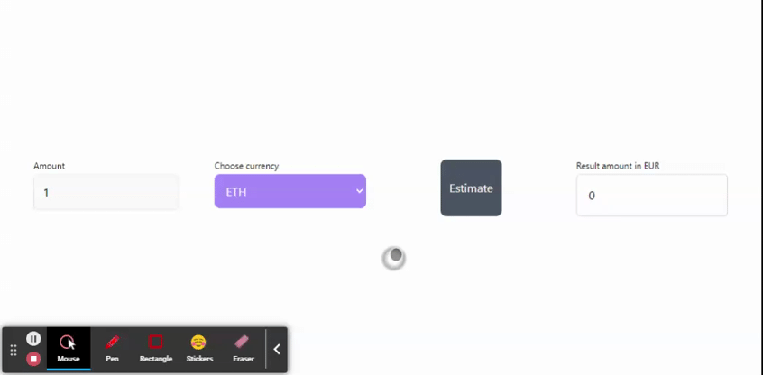

# Exchange service - Guardarian

### API Documentation: 
https://api-payments.guardarian.com/v1/api-docs
https://documenter.getpostman.com/view/12908416/TVRhaoYL#fb733188-a922-481f-a2d2-41796d9c6dfd

### Running project on local
- Create `.env` file from `.env.example`
- Add Guardarian API key into `GUARDARIAN_API_KEY`
- Install dependencies `npm install`
- Run `npm start`
- Open browser and go to http://localhost:3000
- Enjoy the Demo :)

